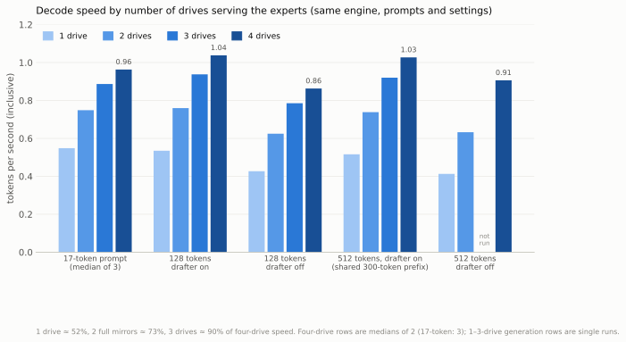
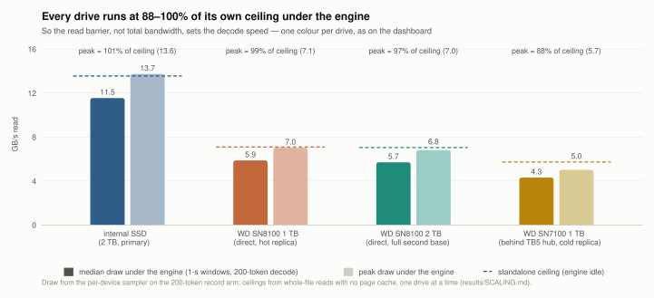

# Storage scaling — how many drives does this need? (2026-09-08)

The headline is measured on four drives. This set asks what one, two and three
drives give, with the same engine, configuration, prompts and lengths as the
standard-length set of the same day. Every arm is cold, one at a time, no monitoring process running. All numbers are inclusive tok/s (engine `[stats] speed`)
unless a column says steady; definitions are in
`RESULTS-2026-09-08-standard-lengths.md`.

## The rungs

| rung | what serves expert reads | kind |
|---|---:|---|
| 1 drive | internal SSD holding all 82,432 experts | full mirror |
| 2 drives | internal SSD (all 82,432) + Green SN8100 2 TB (all 82,432); the router splits every read between the two | full mirrors |
| 3 drives | the layout of record with Yellow removed: internal 69,776 + Green full + White hot replica | usage-weighted layout |
| 4 drives | the layout of record (`placement/`) | usage-weighted layout |

Rungs 1–2 and rungs 3–4 are different kinds of layout, not just different
drive counts. A role is removed by pointing it at an empty directory, so no
file resolves there. For rungs 1 and 2 the 12,656 experts that normally live
only on Green were copied onto the internal SSD for the duration (temporary
space was freed on it first) and removed afterwards; the primary set was
verified back at exactly 69,776 files before rung 3 ran.

Standalone read ceilings measured the same day, whole-file reads with no page
cache: internal 13.6 GB/s, White 7.1, Green 7.1 (the enclosure wall — the 2 TB
drive is no faster than the 1 TB), Yellow 5.7 falling to 5.1 at high queue
depth.

## Results

Four-drive figures are medians of two runs (France: three). One-, two- and
three-drive generation rows are **single runs**; France is a median of three on
every rung.

| test | 1 drive | 2 drives | 3 drives | 4 drives | 1 / 4 | 2 / 4 | 3 / 4 |
|---|---:|---:|---:|---:|---:|---:|---:|
| public prompt "The capital of France is", 17 tokens, median of 3 | 0.5483 | 0.7485 | 0.8869 | 0.9631 | 57% | 78% | 92% |
| generation 128, drafter on | 0.5350 | 0.7596 | 0.9375 | 1.0377 | 52% | 73% | 90% |
| generation 128, drafter off | 0.4269 | 0.6245 | 0.7855 | 0.8630 | 49% | 72% | 91% |
| generation 512, drafter on, first 300 tokens¹ | 0.5160 | 0.7382 | 0.9201 | 1.0271 | 50% | 72% | 90% |
| generation 512, drafter off | 0.4127 | 0.6326 | — | 0.9063 | 46% | 70% | — |
| 512-token prompt, first token | 799 s | 545 s | — | 375 s | 2.1× slower | 1.5× slower | — |

Steady decode (first-token phase excluded), drafter on: 128 tokens 0.5597 /
0.8034 / 0.9981 / 1.1252; 512 tokens over the shared prefix 0.5257 / 0.7543 /
0.9433 / 1.0587.

The three-drive rung ends after its 512-token drafted arm,
so it has no drafter-off 512 and no prefill measurement.

¹ On the two-drive rung the 512-token drafted run produced different text from
token ~305 onward (a near-tie token flip; both continuations are plausible; the
expert files on the two drives were checked byte-identical). After the flip its
text happened to draft far better (406/591 accepted against 247/417), so its
full-length figure, 0.8303, mixes storage speed with a text-dependent drafting
advantage. The row therefore compares the drafted 512 arms over the first 300
tokens, where every rung produced identical text and identical work (77 chunks).
Full-length drafted 512 figures for the record: 0.4801 / 0.8303 / 0.8814 / 0.9849.

## What the numbers say

**Decode scales with the combined read bandwidth, a little below proportional.**
One drive (13.6 GB/s) gives about half of four (roughly 33 GB/s of ceilings);
two full mirrors (20.7 GB/s) give about seven tenths; removing the slowest
drive from the layout of record costs 8–10%. The drafter is worth more when
fewer drives set the barrier: +25% on one drive at 128 tokens against +20% on
four.

**Prefill scales with bandwidth too, and it is the expensive part.** The
512-token prompt's first token takes 13.3 minutes on one drive, 9.1 on two, 6.2
on four. The engine's own timers attribute 86% of the single-drive prefill to
waiting for expert reads; the prompt is read as nine terabytes for a 1.4 TB
model because the rows are processed in passes that each re-read a layer's
experts. That is an engine scheduling cost, not a storage one, and it is the
next thing to fix.

**The internal drive alone lands below the published single figure.** The
public reference for the France prompt is 0.6840 tok/s; our internal-only
median is 0.5483. The public setup is not documented as single-drive, so that
is not a like-for-like comparison; the four-drive 0.9631 is the fair one.

**Identity across layouts is not claimed.** On a given layout the prompts of
record are token-identical between drafter on and off. Between storage layouts,
expert-tile arrival order changes the floating-point accumulation order under
arrival-driven compute, and at a genuine near-tie a token can flip: one such
flip was observed at token ~305 of 512 on the two-holder layout; both
continuations are plausible, and 40 of 40 sampled expert files were
byte-identical across holders, so the data was not corrupted. The 128-token
outputs were token-identical across all four rungs.

**Both readings of the ladder are true.** At four drives, after the read
balancer, storage capability was not the constraint on decode — every drive
runs at 90–100% of its own ceiling and the remaining cost is scheduling. Below
four drives it binds hard: 57 / 78 / 92% at one, two and three. "Do more drives
help?" has the empirical answer: yes, near-proportionally to combined read
bandwidth, up to the point where the tails rather than the bandwidth set the
barrier.

Reproduce: the same `deltafin run` invocations as the standard-length set,
with a role removed by pointing its variable (`K3_EXPERT_HOT_DIR`,
`K3_EXPERT_DIR_C`, or for rung 1 also `K3_EXPERT_DIR_B`) at an empty directory;
rungs 1 and 2 additionally require every expert to be present in
`DELTAFIN_ROOT/k3-experts`.
